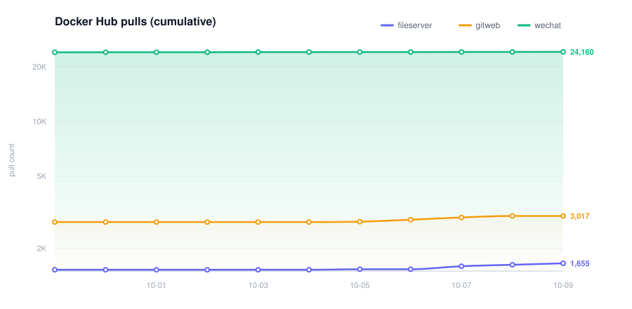

# dockerfile

## Description
My own local docker service, patched on the basis of different
warehouses, just to suit my personal needs.

## Docker Hub pull trends

Pull counts are collected once a day by the
[metrics workflow](.github/workflows/metrics.yml) and stored in
[`metrics/data/pull_counts.csv`](./metrics/data/pull_counts.csv).
See [`metrics/README.md`](./metrics/README.md) for details.

<picture>
  <source media="(prefers-color-scheme: dark)" srcset="./docs/pull-counts-dark.svg">
  <source media="(prefers-color-scheme: light)" srcset="./docs/pull-counts.svg">
  
</picture>

The per-day chart (`docs/pull-counts-daily.svg`) appears once at least two days
of data have been collected.

## License

This project is inspired by and builds upon the work of several other open
source projects. We acknowledge their contributions and encourage users to
explore and support those projects as well.

[wechat-x11vnc](https://github.com/yurikorh/wechat-x11vnc)  
[dWeChat](https://github.com/Attack2Defense/dWeChat)  
[gitweb-docker](https://github.com/rockstorm101/gitweb-docker)  
[gitweb-dark-theme](https://github.com/CBenoit/gitweb-dark-theme)  

Their different projects use different protocols, and they should be
supported.However, different license may also conflict with each other,
so the most relaxed [MIT](./LICENSE) is adopted.
